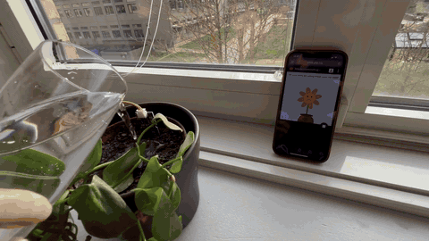
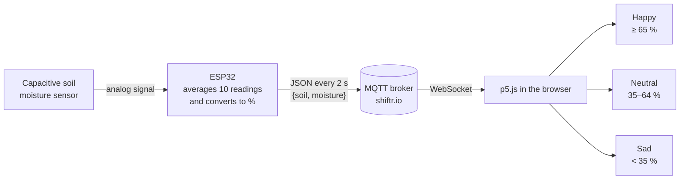
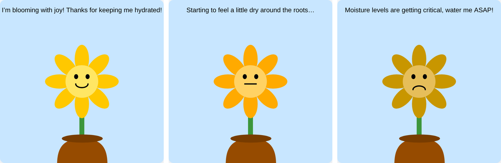
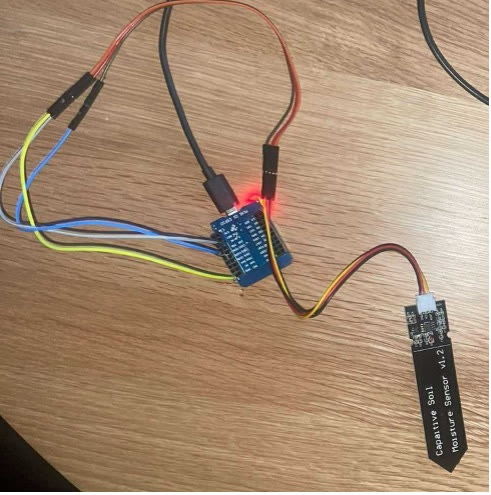
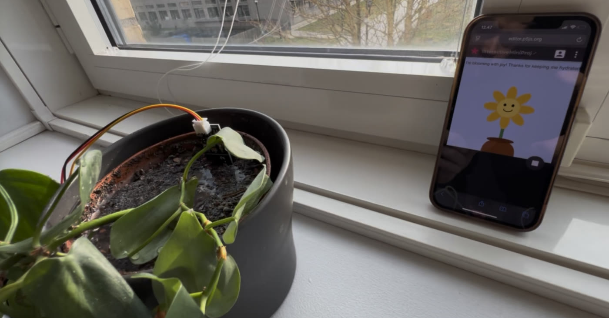

# Plant Moisture Monitor

An IoT system that tells you when your houseplant needs water. An ESP32 reads a soil moisture sensor and publishes the readings over MQTT. A p5.js page in the browser shows the plant's condition as an animated flower that is happy, neutral or sad.

> Group project for the third Subject Module Course in Computer Science at the Department of People and Technology, Roskilde University (2025).

**Tech:** ESP32 · C++ (Arduino) · MQTT · p5.js · JavaScript



*Watering the plant: within a few seconds the flower on the phone goes from neutral to happy.*

**[Try the visualization in your browser →](https://DanielHP7.github.io/plant-moisture-monitor/web/)** (press 1, 2 or 3 to preview the states)

---

## How it works



1. **Sensor → ESP32.** The ESP32 reads the sensor's analog output on GPIO 34. It averages 10 readings to smooth out noise and maps the raw value to a moisture percentage using calibration values.
2. **ESP32 → MQTT.** Every 2 seconds it publishes a JSON message such as `{"soil":1320,"moisture":71}` to the topic `esp32IDS/Plant1`.
3. **MQTT → browser.** The p5.js sketch subscribes to the same topic over WebSocket and updates the flower whenever a new reading arrives.



---

## Hardware



- Wemos D1 Mini ESP32
- Capacitive Soil Moisture Sensor v1.2

| Sensor pin | ESP32 pin |
|---|---|
| GND | GND |
| VCC | 3.3V |
| AOUT | GPIO 34 (ADC) |

**Calibration.** In dry air the sensor reads about 2,500, and fully submerged in water about 800–850. These readings define 0 % (2507) and 100 % (850) in the firmware.

<br clear="right">



---

## Getting started

### 1. Firmware (ESP32)

1. Install the [Arduino IDE](https://www.arduino.cc/en/software) with ESP32 board support and the **PubSubClient** library.
2. In `firmware/soil_moisture_mqtt/`, copy `secrets.example.h` to `secrets.h` and fill in your WiFi name and password. `secrets.h` is in `.gitignore`, so it is never committed.
3. Open `soil_moisture_mqtt.ino`, select your board and upload.
4. Open the Serial Monitor at 9600 baud. You should see lines like `Soil raw: 2503 | Moisture: 0%`.

### 2. Visualization (browser)

Open `web/index.html` in a browser. It connects to the public broker at `public.cloud.shiftr.io` and shows live data as soon as the ESP32 publishes.

No sensor? Press **1**, **2** or **3** to preview the happy, neutral and sad states.

> The project uses shiftr.io's public broker, which anyone can read from and publish to. A real deployment should use a private broker with authentication.

```
├── firmware/soil_moisture_mqtt/
│   ├── soil_moisture_mqtt.ino   # Reads the sensor and publishes to MQTT
│   └── secrets.example.h        # Template for WiFi credentials
├── web/
│   ├── index.html
│   └── sketch.js                # MQTT subscription and flower visualization
└── docs/                        # Images used in this README
```

---

## What we learned

- **Choose the right sensor.** Our first sensor (DHT11) measures air humidity, not soil moisture. Switching to a capacitive soil sensor made the readings reliable.
- **Raw sensor data is noisy.** Averaging 10 readings per measurement gave a stable signal.
- **Calibration depends on the environment.** Soil type and conditions change the sensor output, so we tuned the thresholds by testing until the flower matched when the plant actually needed water.

**Next steps:** show moisture history over time, add sensors for temperature and light, and move to a private broker with notifications when the plant needs water.

## Team

Mads Degn, Julia Lundager, Daniel Holst Pedersen, Jonas Pheiffer and Magnus Stilling Østergaard.

**My contribution:** I worked on the hardware setup and the MQTT communication between the ESP32 and the browser.
